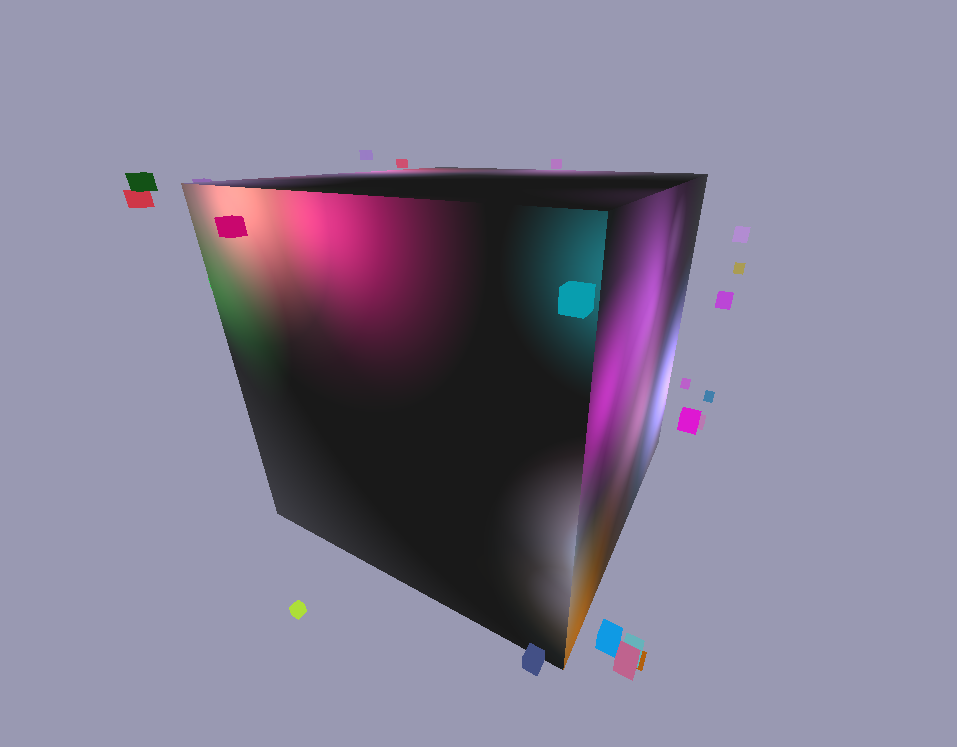
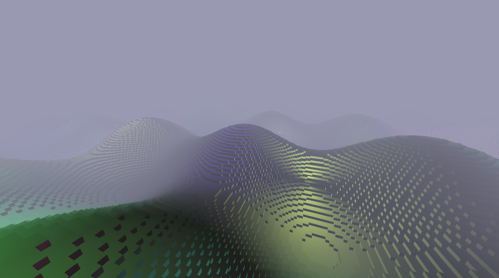
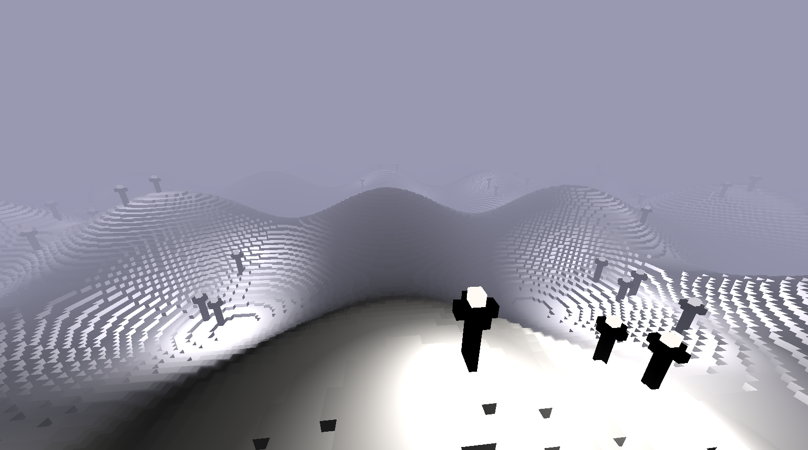
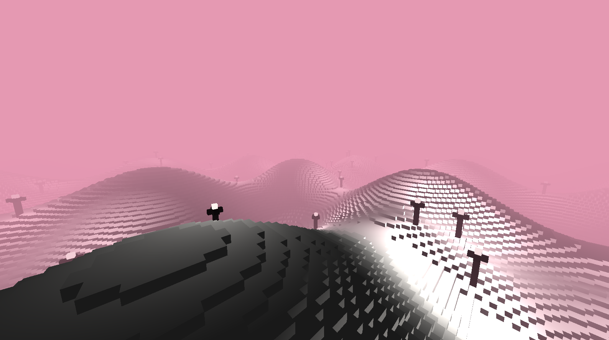
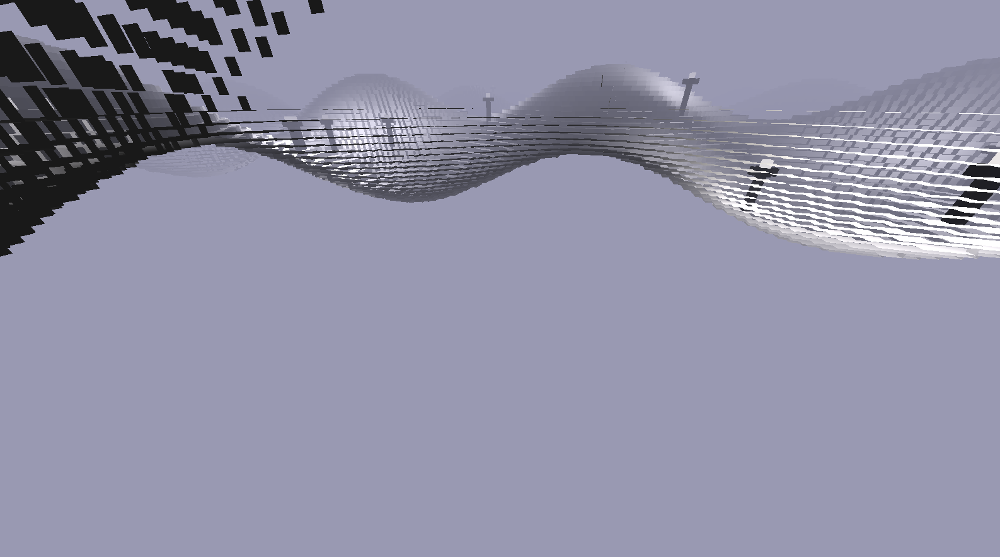

# Overview

This is a Voxel Engine built in C# with OpenTK (The C# Wrapper of OpenGL)

# Features

This engine allows you to build voxel worlds one cube at a time.
It also has support for multi coloured lighting.



The world also allows you to generate terrain using your own functions



You can also populate the world with structures, using the custom structure file.

This is an example of a structure file for a simple lamp post.

```
# This is the template for the structure files
# it starts with the cube type definitions
# static types look like this

# def static <R> <G> <B> <alpha> <shiny>
def static 0 0 0 1 1

# def light <R> <G> <B> <distance>
def light 1 0.98 0.956 30

# then the actual cubes will be defined afterwards
# c <index of type from defs above> <x> <y> <z>

c 0 0 0 0
c 0 0 1 0
c 0 0 2 0
c 0 0 3 0
c 0 0 4 0
c 0 0 5 0
c 0 0 6 0
c 0 1 6 0
c 0 0 6 1
c 0 -1 6 0
c 0 0 6 -1

# to add a point light to the structure you would do this
# l <index> <X> <Y> <Z>
# Note: the x y z coordinates can be float with lights

l 0 0 7 0
```

And here is a world with lots of them scattered about



You can also change the colour of the sky and fog in this world to give it a different feel.



This world will also load as the game runs an once a chunk is out of view range it will be culled out.


# Optimizations

This world does cull all voxel faces that are obscured using bitwise operators


